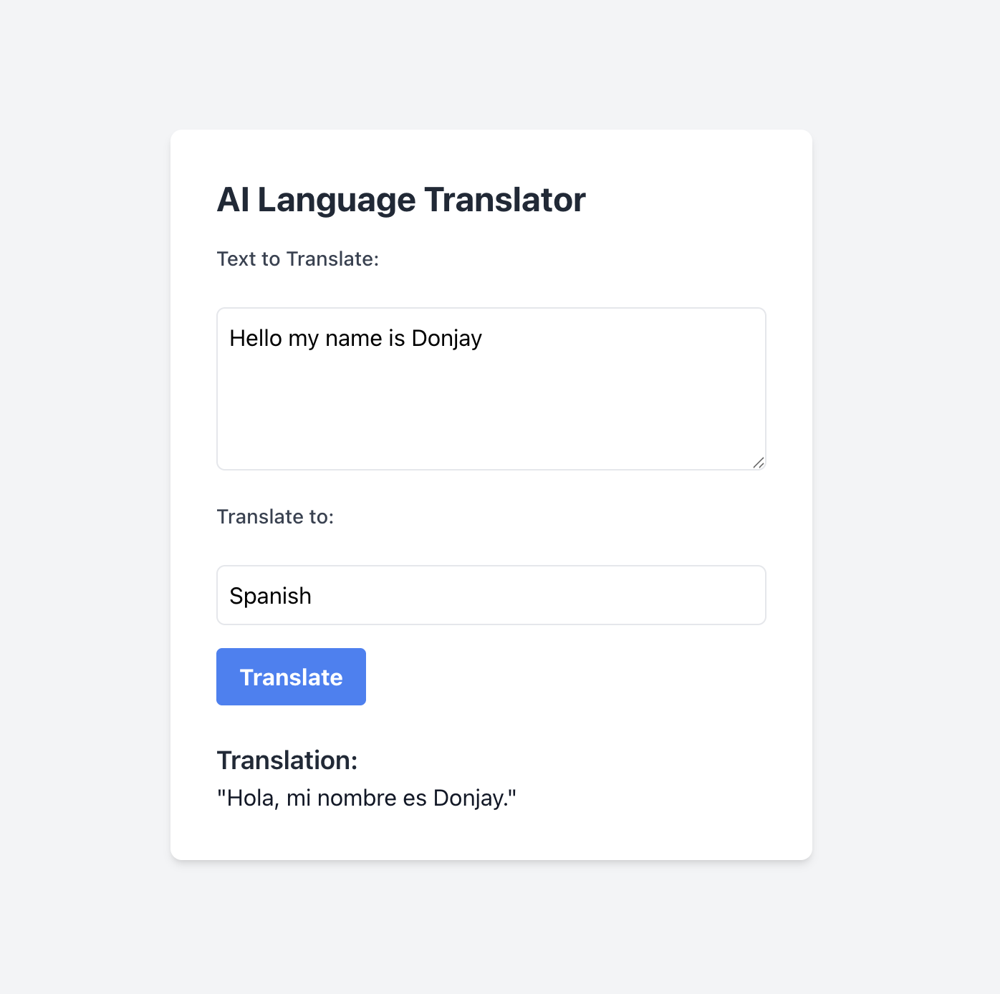

# Translator AI

This is a simple AI language translator that leverages the OpenAI API for translating texts to other languages. It consists of a React front-end for user interaction and a Node.js/Express back-end to handle API requests and interact with OpenAI.

## Table of Contents

- [Features](#features)
- [Technologies Used](#technologies-used)
- [Prerequisites](#prerequisites)
- [Installation](#installation)
- [Configuration](#configuration)
- [Running the Application](#running-the-application)
- [Usage](#usage)
- [Screenshot](#screenshot)
- [License](#license)

## Features

- Translate text from any language supported by the OpenAI API to a target language.
- Simple and intuitive user interface built with React and styled with Tailwind CSS.

## Technologies Used

**Front-end (Client):**

- [React](https://react.dev/) - JavaScript library for building user interfaces.
- [TypeScript](https://www.typescriptlang.org/) - Superset of JavaScript that adds static typing.
- [Tailwind CSS](https://tailwindcss.com/) - Utility-first CSS framework for rapid styling.
- [Create React App](https://create-react-app.dev/) - Toolchain for setting up React development environments.

**Back-end (Server):**

- [Node.js](https://nodejs.org/) - JavaScript runtime environment.
- [Express.js](https://expressjs.com/) - Minimalist web application framework for Node.js.
- [TypeScript](https://www.typescriptlang.org/) - Superset of JavaScript that adds static typing.
- [dotenv](https://www.npmjs.com/package/dotenv) - For loading environment variables from a `.env` file.
- [openai](https://www.npmjs.com/package/openai) - Official Node.js library for the OpenAI API.
- [cors](https://www.npmjs.com/package/cors) - Middleware for handling Cross-Origin Resource Sharing.
- [nodemon](https://www.npmjs.com/package/nodemon) (dev dependency) - For automatic restarting of the Node.js server during development.
- [concurrently](https://www.npmjs.com/package/concurrently) (dev dependency) - For running the client and server development servers concurrently.

## Prerequisites

- [Node.js](https://nodejs.org/) (LTS version recommended)
- [npm](https://www.npmjs.com/) (comes with Node.js)
- OpenAI API key ([Get one here](https://platform.openai.com/api-keys))

## Installation

1.  **Clone the repository:**
    ```bash
    git clone <repository_url>
    cd ai-language-translator
    ```

2.  **Install server dependencies:**
    ```bash
    cd server
    npm install
    cd ..
    ```

3.  **Install client dependencies:**
    ```bash
    cd client
    npm install
    cd ..
    ```

## Configuration

1.  **Create a `.env` file in the server directory:**
    ```
    OPENAI_API_KEY=YOUR_OPENAI_API_KEY_HERE
    ```
    Replace `YOUR_OPENAI_API_KEY_HERE` with your actual OpenAI API key.

2.  **(Optional) Adjust server port:** You can modify the server port in `server/src/index.ts` if needed:
    ```typescript
    const port = process.env.PORT || 3001;
    ```

3.  **(Optional) Adjust client proxy:** If your server runs on a different port than `3001`, update the `proxy` field in `client/package.json`:
    ```json
    "proxy": "http://localhost:YOUR_SERVER_PORT"
    ```

## Running the Application

1.  **Start both the client and server in development mode:**
    ```bash
    npm run start
    ```
    This command (configured in the root `package.json`) will concurrently start the React development server (usually on `http://localhost:3000`) and the Node.js server (usually on `http://localhost:3001`).

2.  **Open your browser and navigate to `http://localhost:3000` to use the translator.**

## Usage

1.  Enter the text you want to translate in the "Text to Translate" textarea.
2.  Enter the desired target language in the "Translate to" input field (e.g., "Spanish", "French", "Japanese", "Chinese", "Korean", "Russian").
3.  Click the "Translate" button.
4.  The translation text will then be displayed.

## Screenshot



## License

[MIT](LICENSE)